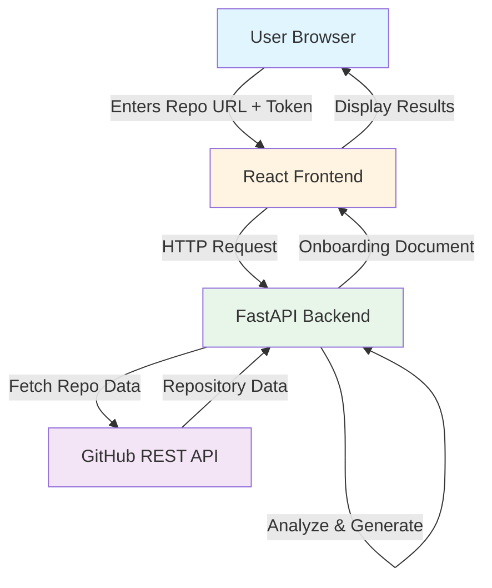
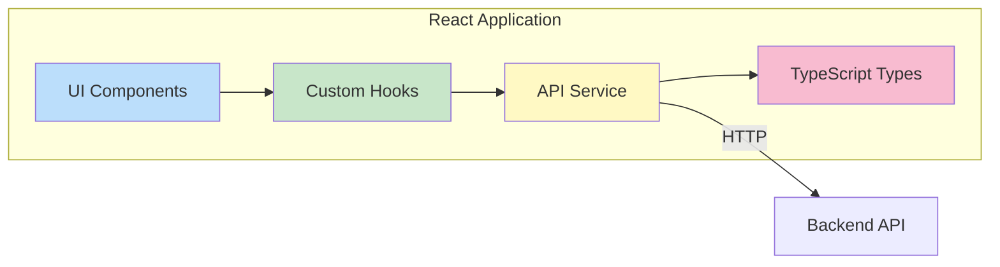
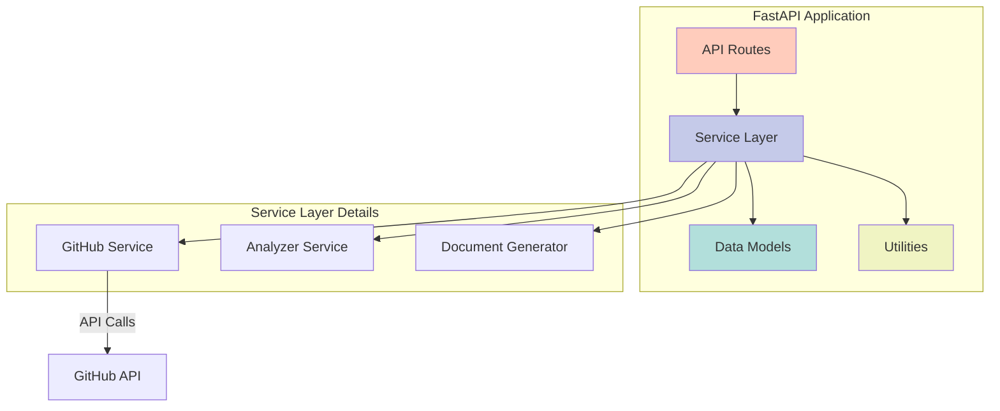
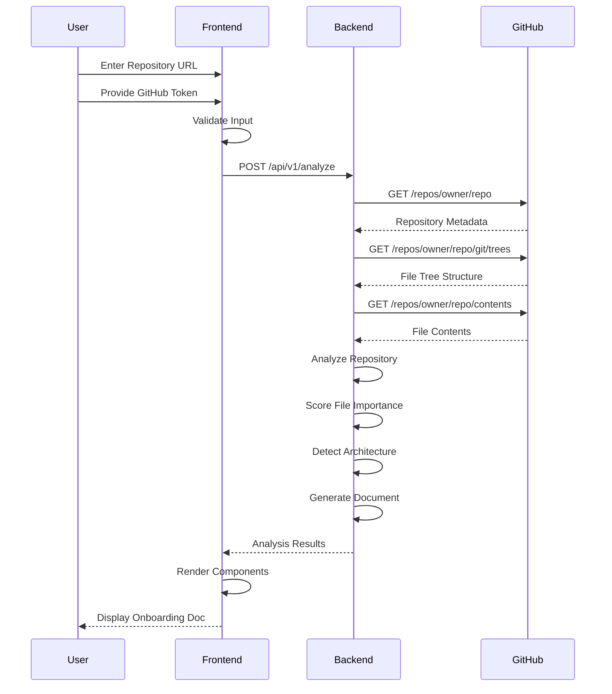
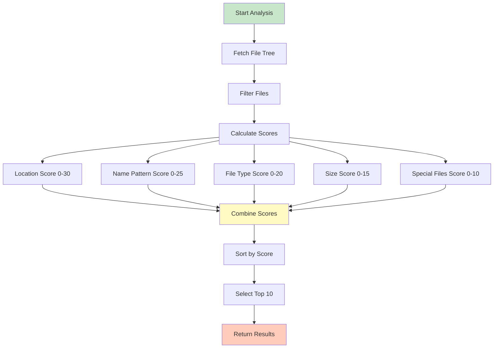
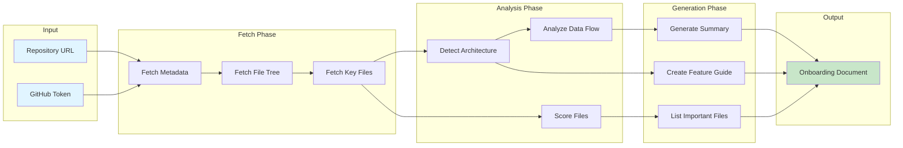
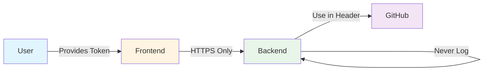
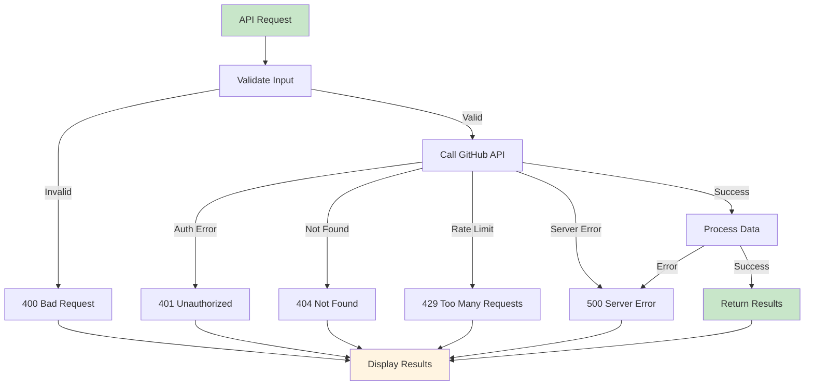
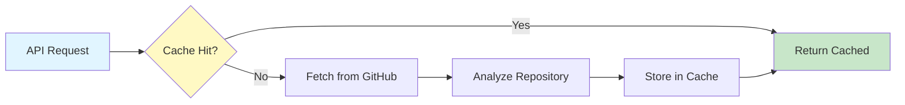
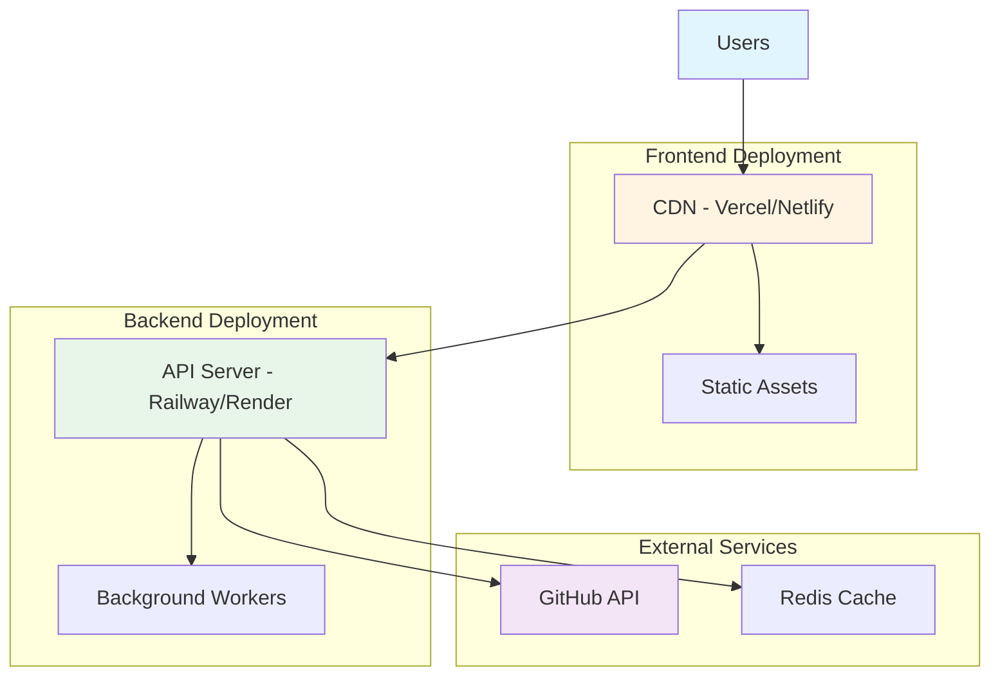

# DevOnboard - System Architecture

## High-Level Architecture



## Component Architecture

### Frontend Architecture



### Backend Architecture



## Data Flow Diagram



## File Importance Scoring Flow



## Repository Analysis Process



## Technology Stack

### Backend Stack

| Component | Technology | Purpose |
|-----------|-----------|---------|
| Framework | FastAPI | High-performance async web framework |
| Language | Python 3.10+ | Backend logic and API |
| HTTP Client | httpx | Async GitHub API requests |
| Validation | Pydantic | Data validation and serialization |
| Server | Uvicorn | ASGI server |
| Environment | python-dotenv | Environment variable management |

### Frontend Stack

| Component | Technology | Purpose |
|-----------|-----------|---------|
| Framework | React 18 | UI component library |
| Language | TypeScript | Type-safe JavaScript |
| Build Tool | Vite | Fast development and building |
| HTTP Client | Axios | API communication |
| Styling | Tailwind CSS | Utility-first CSS framework |
| Markdown | react-markdown | Render markdown content |
| Icons | lucide-react | Icon library |

### External Services

| Service | Purpose | Rate Limit |
|---------|---------|------------|
| GitHub REST API | Repository data fetching | 5000 req/hour (authenticated) |

## API Endpoint Design

### POST /api/v1/analyze

**Purpose**: Analyze a GitHub repository and generate onboarding documentation

**Request Flow**:
1. Validate repository URL format
2. Validate GitHub token
3. Fetch repository metadata
4. Fetch file tree structure
5. Fetch contents of important files
6. Analyze and score files
7. Detect architecture patterns
8. Generate onboarding document
9. Return structured response

**Response Structure**:
```json
{
  "repository": {
    "name": "string",
    "owner": "string",
    "description": "string",
    "language": "string",
    "stars": "number",
    "forks": "number"
  },
  "analysis": {
    "architecture_summary": {
      "project_type": "string",
      "tech_stack": ["string"],
      "description": "string"
    },
    "important_files": [
      {
        "path": "string",
        "importance_score": "number",
        "reason": "string",
        "lines_of_code": "number",
        "language": "string"
      }
    ],
    "data_flow": {
      "description": "string",
      "components": [
        {
          "name": "string",
          "description": "string",
          "files": ["string"]
        }
      ]
    },
    "feature_guide": {
      "steps": [
        {
          "step": "number",
          "title": "string",
          "description": "string",
          "files_to_modify": ["string"]
        }
      ]
    }
  },
  "metadata": {
    "analyzed_at": "string",
    "total_files": "number",
    "analyzed_files": "number"
  }
}
```

## Security Considerations

### GitHub Token Handling



**Security Measures**:
1. Token transmitted over HTTPS only
2. Token never stored in database or logs
3. Token used only for GitHub API requests
4. Token included in Authorization header
5. Frontend stores token in memory only (not localStorage)
6. Clear security warnings in UI

## Error Handling Strategy

### Error Types and Responses

| Error Type | HTTP Status | User Message |
|------------|-------------|--------------|
| Invalid URL | 400 | "Please provide a valid GitHub repository URL" |
| Invalid Token | 401 | "GitHub token is invalid or expired" |
| Repository Not Found | 404 | "Repository not found or not accessible" |
| Rate Limit Exceeded | 429 | "GitHub API rate limit exceeded. Please try again later" |
| Repository Too Large | 413 | "Repository is too large to analyze" |
| Network Error | 503 | "Unable to connect to GitHub. Please check your connection" |
| Server Error | 500 | "An unexpected error occurred. Please try again" |

### Error Flow



## Performance Optimization

### Caching Strategy (Future Enhancement)



### Optimization Techniques

1. **Lazy Loading**: Fetch file contents only for top-scored files
2. **Pagination**: Process large repositories in chunks
3. **Parallel Requests**: Fetch multiple files concurrently
4. **Response Compression**: Enable gzip compression
5. **File Size Limits**: Skip files larger than 500KB
6. **Smart Filtering**: Ignore common directories (node_modules, .git, etc.)

## Deployment Architecture (Future)



## Scalability Considerations

### Current Design (Hackathon)
- Single server deployment
- Synchronous processing
- No caching layer
- Direct GitHub API calls

### Future Scalability
- Horizontal scaling with load balancer
- Background job processing with Celery/RQ
- Redis caching layer
- Database for storing analysis results
- CDN for static assets
- Rate limiting per user
- WebSocket for real-time updates

## Development Environment Setup

### Prerequisites
- Python 3.10 or higher
- Node.js 18 or higher
- Git
- GitHub personal access token
- Code editor (VS Code recommended)

### Local Development Ports
- Backend API: `http://localhost:8000`
- Frontend Dev Server: `http://localhost:5173`
- API Documentation: `http://localhost:8000/docs`

## Testing Strategy

### Backend Testing
- Unit tests for analyzer logic
- Integration tests for GitHub API service
- API endpoint tests
- Mock GitHub API responses

### Frontend Testing
- Component unit tests
- Integration tests for API calls
- E2E tests with Playwright (optional)

### Manual Testing Checklist
- [ ] Small repository (< 50 files)
- [ ] Medium repository (50-200 files)
- [ ] Large repository (> 200 files)
- [ ] Python project
- [ ] JavaScript/TypeScript project
- [ ] Multi-language project
- [ ] Repository with README
- [ ] Repository without README
- [ ] Private repository
- [ ] Invalid repository URL
- [ ] Invalid GitHub token
- [ ] Rate limit handling

## Success Criteria

### Functional Requirements
✅ Accept GitHub repository URL
✅ Validate GitHub token
✅ Fetch repository structure
✅ Analyze file importance
✅ Detect project architecture
✅ Generate onboarding document
✅ Display results in clean UI
✅ Handle errors gracefully

### Non-Functional Requirements
✅ Response time < 10 seconds for typical repository
✅ Support repositories up to 500 files
✅ Mobile-responsive UI
✅ Clear error messages
✅ Intuitive user experience

## Future Enhancements Roadmap

### Phase 1: AI Integration
- OpenAI GPT-4 for intelligent summaries
- Context-aware feature guides
- Code explanation generation

### Phase 2: Advanced Analysis
- Dependency graph visualization
- Code quality metrics
- Security vulnerability scanning
- Test coverage analysis

### Phase 3: Collaboration Features
- Team workspaces
- Shared analysis results
- Comments and annotations
- Export to various formats

### Phase 4: Platform Integration
- VS Code extension
- GitHub App integration
- Slack/Discord notifications
- CI/CD pipeline integration

---

**Document Version**: 1.0  
**Last Updated**: 2026-05-02  
**Status**: Ready for Implementation